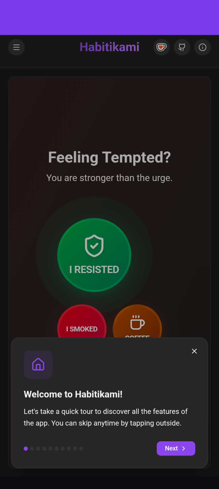
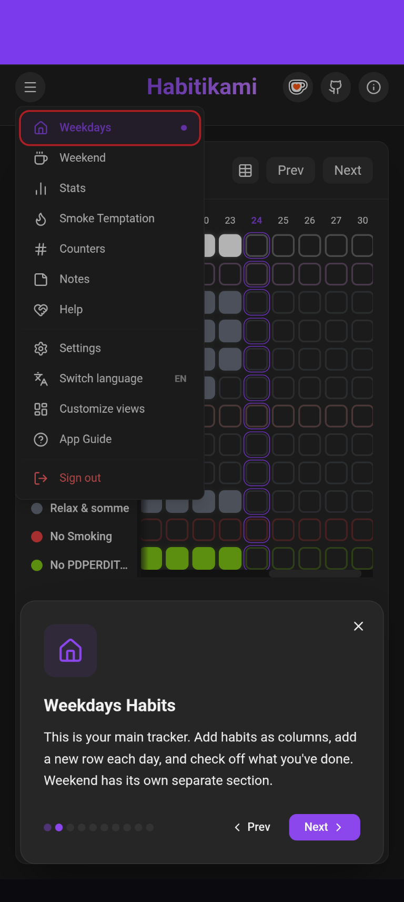
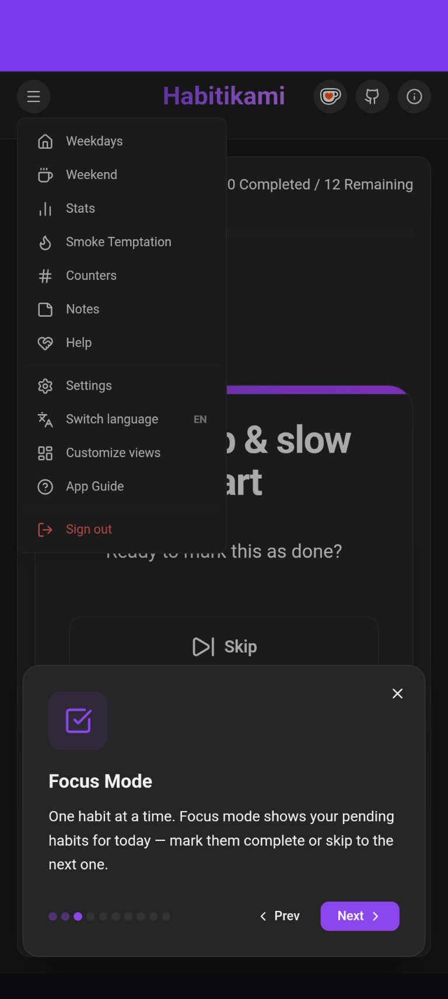
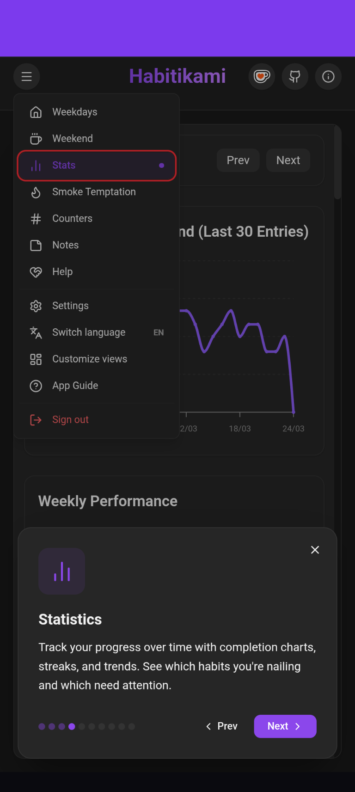
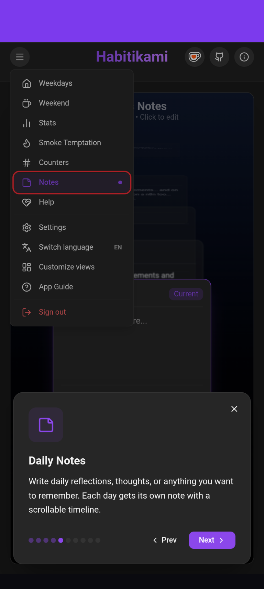
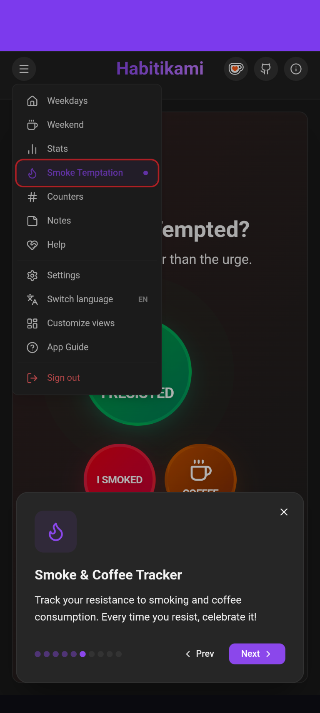
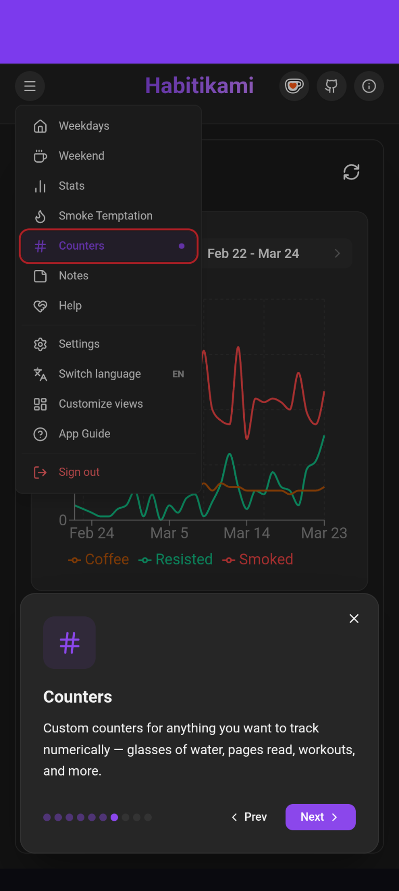
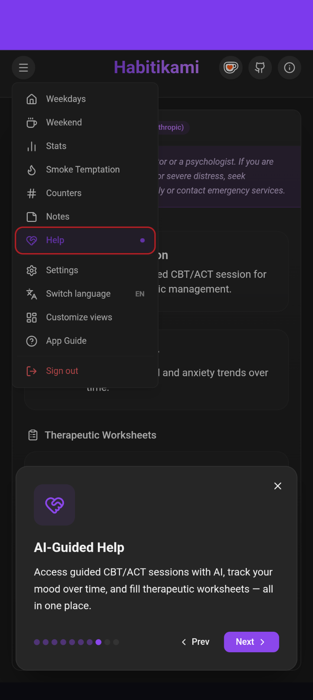
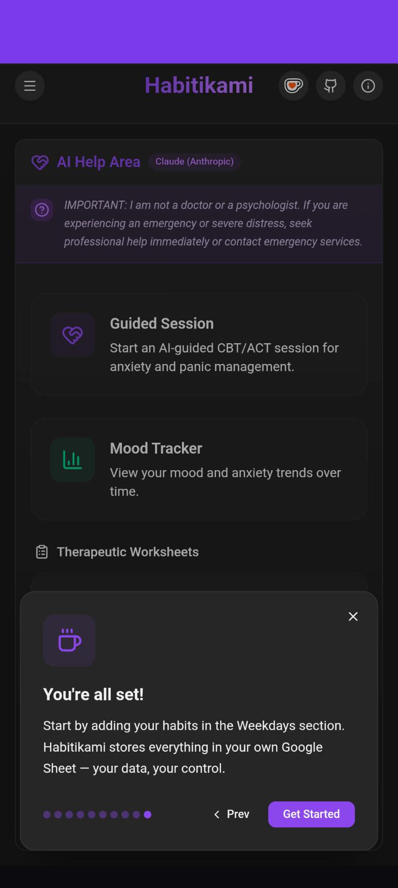

# Habitikami

A habit tracking platform with a web app and an Android companion app with home screen widgets.

## Projects

### [habitikami-web](./habitikami-web)

A **React + Vite + TypeScript** progressive web app for daily habit tracking, powered by Google Sheets as a backend.

**Features:**
- Track daily habits with a checkbox grid and compact views
- Counters, mood tracking, and smoke temptation logging
- Graphs and analytics to visualize completion rates over time
- Google Sheets integration — authenticates via Google Identity Services and reads/writes directly to your spreadsheet
- Responsive design with Tailwind CSS
- Dockerized with Nginx for self-hosting
- Multi-user support via Express backend

**Tech stack:** React 19, TypeScript, Vite, Tailwind CSS, Recharts, Framer Motion, Express, Google Sheets API

### [habitikami-android-and-widgets](./habitikami-android-and-widgets)

A native **Android** app using Trusted Web Activity (TWA) to deliver the Habitikami PWA (`habitikami.kambei.dev`) as a full-screen native experience, with home screen widgets for quick habit tracking.

**Features:**
- TWA-based launcher with Digital Asset Links verification
- Counter widget — increment daily counters (resist, smoked, coffee) from the home screen
- Stats widget — habit completion heatmap with configurable habit picker
- Help widget — quick access to Habitikami help and AI assistance
- Widget configuration with server URL and API key authentication

**Tech stack:** Kotlin, Android SDK, Gradle, AndroidBrowserHelper, Coroutines

## Screenshots

  
  
  
  
  
  
  
  
  

## Getting Started

See each project's own README for setup instructions:
- [Web app setup](./habitikami-web/README.md)

## License

This project is licensed under the [MIT License](./LICENSE).
